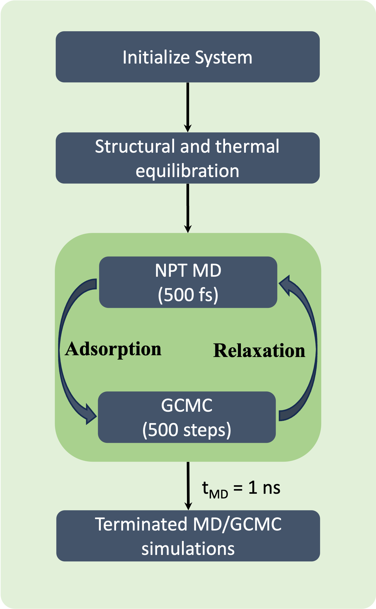

# MLP Besed Flexible Framework Adsorption Simulation with Hybrid MD/GCMC

This repository contains code for performing adsorption simulations in metal-organic frameworks (MOFs) using both MLP-based rigid GCMC and hybrid MD/GCMC simulations that incorporate framework flexibility. The simulations leverage a machine-learned potential (MLP), specifically a equivariant interatomic potentials (NeqIP)

The code is actively under development. We warmly welcome contributions from the community — whether it's fixing issues, improving documentation, or extending functionality.

## Hybrid MD/GCMC Workflow

The overall workflow of the simulation algorithm is illustrated in the following scheme, summarizing the key steps of the MLP-based GCMC and hybrid MD/GCMC approach.


<p float="center">
  
</p>


## Installaitoin

Before running the simulation code, ensure the following Python packages are installed:

- `nequip`
- `pair_nequip`
- `ase`
- `molmod`
- `CoolProp`

You can install them using pip:

```bash
pip install numpy torch ase molmod CoolProp
```

Clone this repository using:
```bash
git clone https://github.com/yourusername/your-repo-name.git
cd your-repo-name
```


## How To Use

## Cite us
Modeling CO2 Adsorption in Flexible MOFs with Open Metal Sites via Fragment-Based Neural Network Potentials, Omer Tayfuroglu andSeda Keskin.
https://doi.org/10.26434/chemrxiv-2025-c85xt
