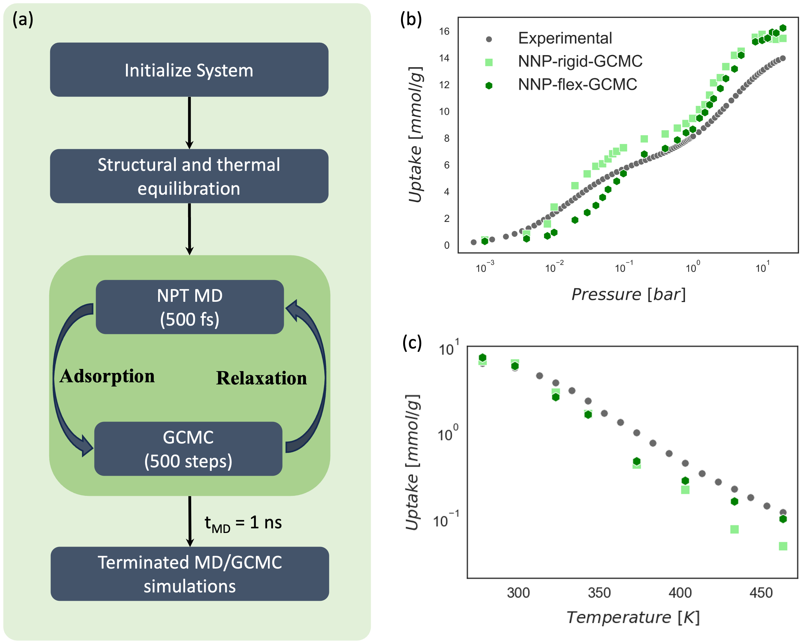

# MLP Based Flexible Framework Adsorption Simulation with MD/GCMC

This repository contains code for performing adsorption simulations in metal-organic frameworks (MOFs) using both MLP-based rigid GCMC and hybrid MD/GCMC simulations that incorporate framework flexibility. The simulations leverage a machine-learned potential (MLP), specifically a equivariant interatomic potentials (NeqIP)

The code is actively under development. We warmly welcome contributions from the community — whether it's fixing issues, improving documentation, or extending functionality.

The overall workflow of the simulation algorithm is illustrated in the following scheme, (a) summarizing the key steps of the MLP-based GCMC and hybrid MD/GCMC approach, (b) isotermal and (c) isobaric adsoption results.

<br/>
<p align="center">
  
</p>

### Releted paper
Modeling CO2 Adsorption in Flexible MOFs with Open Metal Sites via Fragment-Based Neural Network Potentials, Omer Tayfuroglu and Seda Keskin.
https://doi.org/10.26434/chemrxiv-2025-c85xt

## Requirements

Before running the simulation code, ensure the following Python packages are installed:

- `nequip`
- `pair_nequip`
- `ase`
- `molmod`
- `CoolProp`

## Installation

```bash
conda create --name mdmc python=3.10
conda activate mdmc
```

You can install requirements using pip:

```bash
pip install numpy torch ase molmod CoolProp
```

Clone this repository using:
```bash
git clone https://github.com/otayfuroglu/deepMDMC.git
```


## How to Use

### Rigid GCMC Simulation

To run a **rigid GCMC adsorption simulation**, set `sim_type` to `rigid` and `nmdsteps` to `0`. You can choose large values (e.g., 250,000) for `nmcswap` and `nmcmoves` to ensure sufficient Monte Carlo sampling. Geometry optimization (`-opt`) is optional and typically set to `no` for rigid frameworks.

Below is an example script for running a rigid GCMC simulation:

```bash
SCRIPT_DIR=/path/to/mdmc
model_md_path=/path/to/nequip_model/
model_gcmc_path=/path/to/nequip_model/
struc_path=/path/to/mof_structure
molecule_path=/path/to/guest_molecule
T=298
P=1.0

nmdsteps=0
nmcswap=250000
nmcmoves=250000
timestep=0.0005 # ps

python $SCRIPT_DIR/runDeepMDMC.py \
    -sim_type rigid \
    -pressure $P \
    -temperature $T \
    -timestep $timestep \
    -totalsteps 1000000 \
    -nmdsteps $nmdsteps \
    -nmcswap $nmcswap \
    -nmcmoves $nmcmoves \
    -flex_ads no \
    -opt no \
    -interval 50 \
    -model_gcmc_path $model_gcmc_path \
    -model_md_path $model_md_path \
    -struc_path $struc_path \
    -molecule_path $molecule_path
```

### Flexible GCMC Simulation (MD/GCMC)

To run a flexible framework simulation using hybrid MD/GCMC, set `sim_type` to `gcmcmd`. In this mode, molecular dynamics (MD) and grand canonical Monte Carlo (GCMC) are alternated throughout the simulation.

Recommended settings:
- `nmdsteps=1000` → Number of MD steps between each GCMC stage
- `nmcswap=400`, `nmcmoves=400` → Number of Monte Carlo swap and move attempts per GCMC stage  
- `totalsteps=1000000` → Total number of hybrid MD+GCMC steps (combined)

Below is an example configuration:

```bash
SCRIPT_DIR=/path/to/mdmc
model_md_path=/path/to/nequip_model/
model_gcmc_path=/path/to/nequip_model/
struc_path=/path/to/mof_structure
molecule_path=/path/to/guest_molecule
T=298
P=1.0

nmdsteps=1000
nmcswap=400
nmcmoves=400
timestep=0.0005 # ps

python $SCRIPT_DIR/runDeepMDMC.py \
    -sim_type gcmcmd \
    -pressure $P \
    -temperature $T \
    -timestep $timestep \
    -totalsteps 1000000 \
    -nmdsteps $nmdsteps \
    -nmcswap $nmcswap \
    -nmcmoves $nmcmoves \
    -flex_ads no \
    -opt yes \
    -interval 50 \
    -model_gcmc_path $model_gcmc_path \
    -model_md_path $model_md_path \
    -struc_path $struc_path \
    -molecule_path $molecule_path
```

## Cite us
Modeling CO2 Adsorption in Flexible MOFs with Open Metal Sites via Fragment-Based Neural Network Potentials, Omer Tayfuroglu andSeda Keskin.
https://doi.org/10.26434/chemrxiv-2025-c85xt
